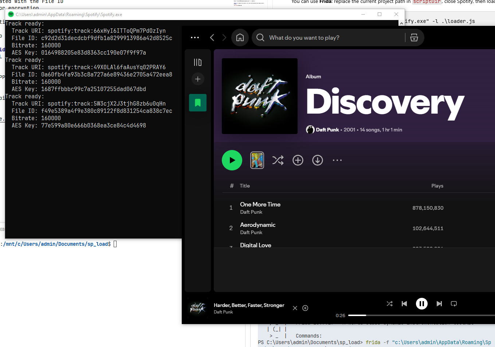

# SpotiLoad

## Spotify mod for Windows x86-64 (1.2.86.502)

**This project only works with Spotify for Windows x86-64 version 1.2.86.502.** \
\
Warning: This project is currently under development. The code is not fully tested and many changes are expected before a reliable release.

At the moment this project only allows displaying in a console the following information for a playing track:
* Track URI
* File ID
* Bitrate associated with the File ID
* AES key used for encryption

No download functionality is implemented

At the moment no "user-friendly" method is implemented to inject the mod (as DLL) into the Spotify process. \
You can use Frida: replace the current project path in `scriptDir`, close Spotify, then load the DLL into a new process :

```
frida -f "$env:APPDATA\Spotify\Spotify.exe" -l .\loader.js
```

**Note:** To compile this project, use a Linux LLVM toolchain (WSL "Ubuntu 24.04.4" tested).


